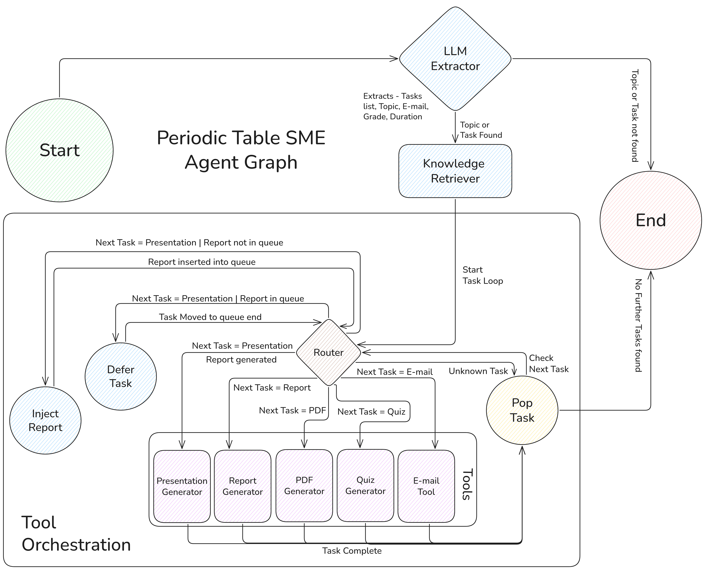
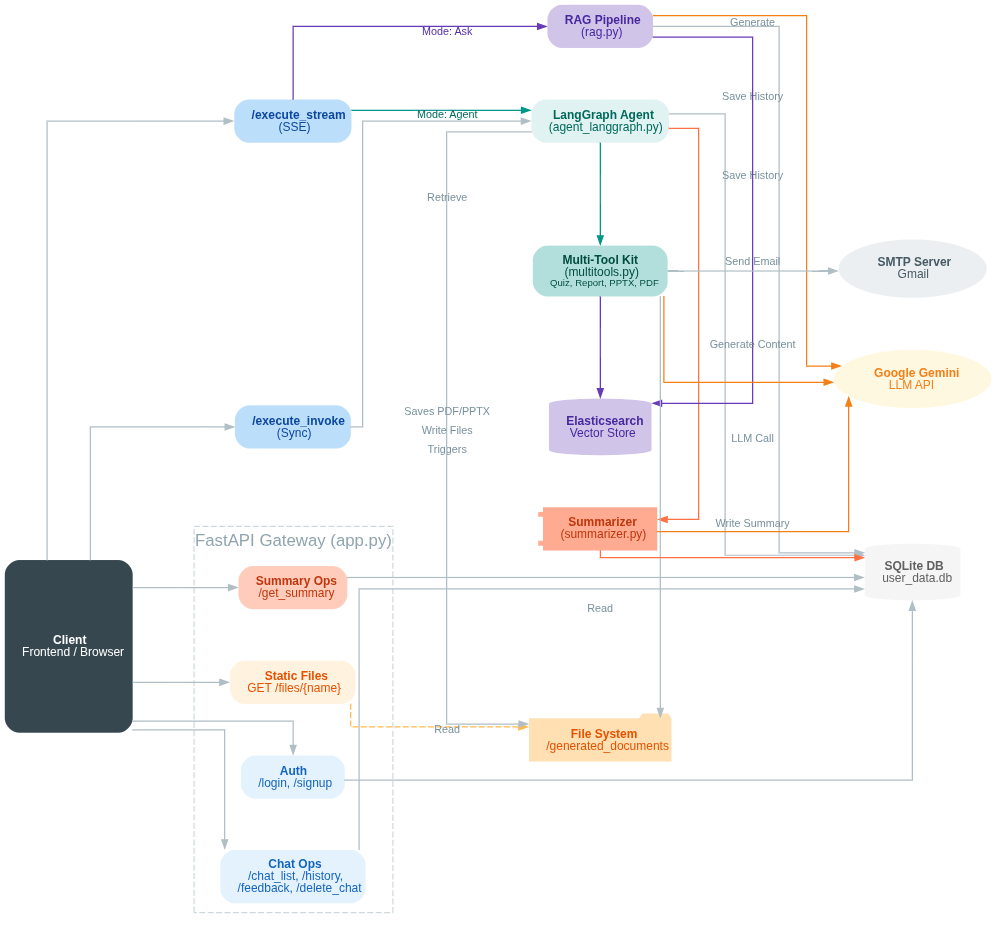
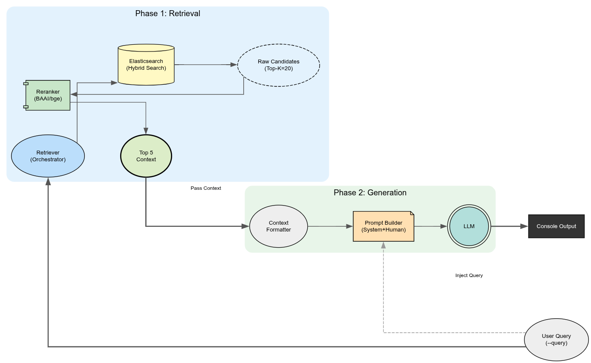

# LMA Major Project - The Aurors

This repository contains the source code for the major project of the "Language Models and Agents" course, submitted by **Team Aurors**:
- **Vysishtya Karanam** - 2022102044
- **Vivek Hruday Kavuri** - 2022114012

## 1. Overview

This project implements a multi-modal, retrieval-augmented generation (RAG) system with an intelligent agent capable of performing complex tasks. The system is designed to answer questions, generate documents (reports, presentations, quizzes), and interact with users through a web-based frontend. It leverages both `gemini` and `qwen` models and includes a robust pipeline for data ingestion, indexing, retrieval, and generation.

## 2. Architecture

The overall architecture of the system is depicted below. It consists of a frontend, a backend server with multiple endpoints, a database for user data, and a vector database (ChromaDB) for storing embeddings.



The system is divided into two main parts: the `gemini` and `qwen` servers, each with its own set of models and configurations. The core logic for handling user requests, processing data, and generating responses is encapsulated within the server applications.

## 3. Directory Structure

Here is a simplified overview of the project's directory structure:

```
.
├── figures
│   ├── API_Structure.png
│   ├── architecture.png
│   └── rag_flow.png
├── gemini
│   ├── agent_langgraph.py        # Core agent logic using LangGraph
│   ├── app.py                    # FastAPI application for the Gemini server
│   ├── data                      # Raw data sources (PDFs, CSVs)
│   │   ├── Textbook_data
│   │   └── Website_Data
│   ├── database.py               # User database management
│   ├── evaluation                # Scripts and results for RAG evaluation
│   ├── frontend.html             # Web interface for interacting with the system
│   ├── generated_documents       # Documents created by the agent
│   ├── index_and_embed.py        # Script for creating and storing embeddings
│   ├── ingestion.py              # Data preprocessing and chunking pipeline
│   ├── logs                      # Log files for debugging and monitoring
│   ├── multitools.py             # Custom tools for the agent
│   ├── processed                 # Processed data (chunks, manifests)
│   ├── prompts.json              # Prompts used by the models
│   ├── rag.py                    # RAG pipeline implementation
│   ├── requirements_*.txt        # Python dependencies
│   ├── retrieval.py              # Retrieval logic from ChromaDB
│   └── ...
├── generated_documents           # Centrally generated documents from various tasks
│   └── ...
└── qwen
    ├── server                    # Qwen model server implementation
    │   ├── agent_langgraph.py
    │   ├── app.py
    │   ├── data
    │   ├── generated_documents
    │   ├── index_and_embed.py
    │   ├── ingestion.py
    │   ├── logs
    │   ├── multitools.py
    │   ├── processed
    │   ├── rag.py
    │   └── ...
    └── ...
```

## 4. Getting Started

### Prerequisites

- Python 3.9+
- `pip` for package management
- A virtual environment (recommended)

### Installation

1.  **Clone the repository:**
    ```bash
    git clone <repository-url>
    cd lma-major-project-the-aurors
    ```

2.  **Create and activate a virtual environment:**
    ```bash
    python3 -m venv venv
    source venv/bin/activate
    ```

3.  **Install the dependencies for the Gemini server:**
    ```bash
    pip install -r gemini/requirements_gemini.txt
    pip install -r gemini/requirements_agent.txt
    pip install -r gemini/requirements_tools.txt
    ```

4.  **Install dependencies for the Qwen server (optional):**
    ```bash
    pip install -r qwen/server/requirements_agent.txt
    pip install -r qwen/server/requirements_tools.txt
    ```

### Running the Application

1.  **Navigate to the Gemini server directory:**
    ```bash
    cd gemini
    ```

2.  **Run the data ingestion and embedding pipeline:**
    *This will process the documents in `data/` and create a ChromaDB vector store.*
    ```bash
    python3 ingestion.py
    python3 index_and_embed.py --mode index
    ```

3.  **Start the FastAPI server:**
    ```bash
    uvicorn app:app --host 0.0.0.0 --port 8000 --reload
    ```

4.  **Access the frontend:**
    Open your web browser and go to `http://127.0.0.1:8000/` to interact with the application.

## 5. API Documentation

The backend provides a set of RESTful APIs for user management, chat history, and running the agent/RAG pipelines.



### Core Endpoints

The primary endpoint for interacting with the models is `/execute_stream`. It supports two modes:

| Mode | Description | Endpoint |
|---|---|---|
| `agent` | Full LangGraph multi-task workflow (quiz, report, presentation, etc.) | `/execute_stream` (POST) |
| `ask` | Lightweight Retrieval-Augmented Q&A | `/execute_stream` (POST) |

**Request Body:**
```json
{
  "user_query": "Explain the concept of electronegativity.",
  "user_id": "testuser",
  "mode": "ask",
  "chat_id": "1678886400000"
}
```

### User Management

- `POST /signup`: Create a new user account.
- `POST /login`: Log in and receive a user session.

### Chat History

- `POST /add_chat_history`: Add a user's chat session to the database.
- `GET /get_chat_history/{user_id}/{chat_id}`: Retrieve the chat history for a specific session.

For more details, refer to the `gemini/API_DOCUMENTATION.md` file.

## 6. RAG Flow

The Retrieval-Augmented Generation (RAG) flow is central to the system's ability to answer questions based on the provided documents.



The process is as follows:
1.  **Query**: The user submits a query.
2.  **Embedding**: The query is converted into a vector embedding.
3.  **Retrieval**: The embedding is used to search the ChromaDB vector store for relevant document chunks.
4.  **Re-ranking**: (Optional) A re-ranker model is used to improve the order of retrieved results.
5.  **Generation**: The original query and the retrieved context are passed to the language model to generate a final answer.

## 7. Evaluation

The performance of the RAG pipeline has been evaluated using standard metrics. The scripts and results of this evaluation can be found in the `gemini/evaluation/` directory. This includes comparisons between different models and configurations.

## 8. File Contributions

This section details the primary contributions of each team member to the various files and components of the project. Overall both of us (team members) contributions come down to **50-50 (Equal Contributions)**

| File / Directory | Contribution(s) |
| :--- | :--- |
| `agent_langgraph.py` | Vivek & Vysishtya |
| `API_DOCUMENTATION.md` | Vivek |
| `app.py` | Vivek & Vysishtya |
| `data/` | Both |
| `database.py` | Vivek |
| `evaluation/` | Vysishtya |
| `evaluation_set/` | Vivek & Vysishtya |
| `frontend.html` | Vysishtya |
| `index_and_embed.py` | Vivek & Vysishtya |
| `ingestion.py` | Vivek & Vysishtya |
| `logs/` | Both (Generated) |
| `multitools.py` | Vivek & Vysishtya |
| `processed/` | Both (Generated) |
| `prompts.json` | Vysishtya |
| `rag.py` | Vivek & Vysishtya |
| `README.md` | Vivek & Vysishtya |
| `requirements_*.txt` | Both |
| `retrieval.py` | Vivek & Vysishtya |
| `summarizer.py` | Vivek |
| `utils/` | Vivek & Vysishtya |
| `Report.pdf/` | Vivek & Vysishtya |
| `LMA_Presentation/` | Vivek & Vysishtya |
| `Demo_Video.webm/` | Vivek & Vysishtya |